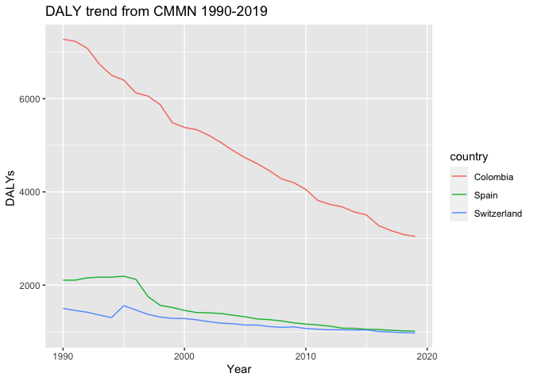

Global Disease Burden Analysis
================
Hugo Santa

# Introduction

This document compares the Disability-Adjusted Life Year (DALY) diseases
burden for three countries: Colombia, Switzerland, and Spain. I compare
the burden due to communicable, maternal, neonatal, and nutritional
diseases (CMNN) for these countries.

The source data is from the Institute for Health Metrics and Evaluation
(IHME) Global Burden of Disease (GBD) study.

# Communicable, Maternal, Neonatal, and Nutritional Disease Burden (CMNN)

## Table of Estimates for CMNN Burden Over Time

| Year | Colombia |    Spain | Switzerland |
|-----:|---------:|---------:|------------:|
| 1990 | 7275.468 | 2104.942 |   1499.9792 |
| 1991 | 7231.688 | 2107.352 |   1455.3930 |
| 1992 | 7080.091 | 2155.470 |   1417.3056 |
| 1993 | 6738.438 | 2170.322 |   1356.1228 |
| 1994 | 6500.664 | 2170.524 |   1304.4203 |
| 1995 | 6398.454 | 2190.630 |   1558.6748 |
| 1996 | 6124.491 | 2123.365 |   1465.5185 |
| 1997 | 6054.719 | 1754.861 |   1372.0308 |
| 1998 | 5871.907 | 1564.835 |   1313.2029 |
| 1999 | 5483.131 | 1519.691 |   1286.8233 |
| 2000 | 5383.338 | 1457.196 |   1282.4212 |
| 2001 | 5335.518 | 1411.106 |   1255.9620 |
| 2002 | 5214.290 | 1404.245 |   1215.3329 |
| 2003 | 5058.455 | 1391.248 |   1183.9231 |
| 2004 | 4886.009 | 1353.643 |   1171.4344 |
| 2005 | 4733.884 | 1320.599 |   1143.5562 |
| 2006 | 4605.434 | 1273.640 |   1143.1385 |
| 2007 | 4454.917 | 1258.970 |   1110.1040 |
| 2008 | 4278.630 | 1231.068 |   1094.4056 |
| 2009 | 4198.258 | 1190.761 |   1103.4031 |
| 2010 | 4052.605 | 1164.083 |   1069.5194 |
| 2011 | 3814.584 | 1144.067 |   1052.9461 |
| 2012 | 3731.865 | 1118.786 |   1041.5221 |
| 2013 | 3677.910 | 1076.263 |   1041.7970 |
| 2014 | 3568.548 | 1072.376 |   1036.2483 |
| 2015 | 3505.624 | 1051.081 |   1039.1022 |
| 2016 | 3276.761 | 1047.250 |   1005.3160 |
| 2017 | 3171.656 | 1030.264 |    993.0077 |
| 2018 | 3089.418 | 1020.240 |    981.4799 |
| 2019 | 3043.929 | 1011.618 |    972.5998 |

## Plot Showing Trends in CMNN Burden Over Time

<!-- -->

## Summary of CMNN Burden Findings

The country with the greater number of DALYs from Communicable,
Maternal, Neonatal and Nutritional diseases overtime was Colombia with
4928.02282447321 average DALYs between 1990 and 2019. The country with
the smaller number of DALYs was Switzerland with 1198.88969301371
average DALYs.
